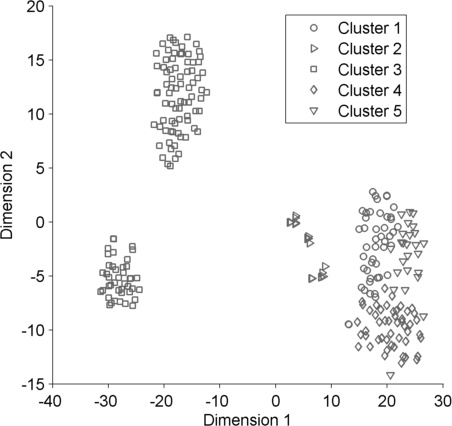
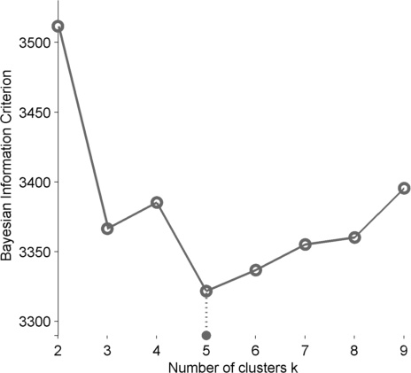

# Mammogram segmentation using multi-atlas deformable registration

Accurate breast region segmentation is an important step in various automated algorithms involving detection of lesions like masses and microcalcifications, and efficient telemammography. While traditional segmentation algorithms underperform due to variations in image quality and shape of the breast region, newer methods from machine learning cannot be readily applied as they need a large training dataset with segmented images. In this paper, we propose to overcome these limitations by combining clustering with deformable image registration. Using clustering, we first identify a set of atlas images that best capture the variation in mammograms. This is done using a clustering algorithm where the number of clusters is determined using model selection on a low-dimensional projection of the images. Then, we use these atlas images to transfer the segmentation to similar images using deformable image registration algorithm.

## Flow chart depicting the proposed flow


## Sample t-SNE projection and associated BIC graph



## BibTeX
```@article{sharma2019mammogram,
  title={Mammogram Segmentation using Multi-atlas Deformable Registration},
  author={Sharma, Manish Kumar and Jas, Mainak and Karale, Vikrant and Sadhu, Anup and Mukhopadhyay, Sudipta},
  journal={bioRxiv},
  pages={542217},
  year={2019},
  publisher={Cold Spring Harbor Laboratory}
}
```

## Links
* [bioRxiv preprint](https://www.biorxiv.org/content/biorxiv/early/2019/02/06/542217.full.pdf)
* [mini-MIAS mammograms ground truths](https://github.com/brsegmentation/brsegmentation)
* [Source codes](https://github.com/brsegmentation/brsegmentation)